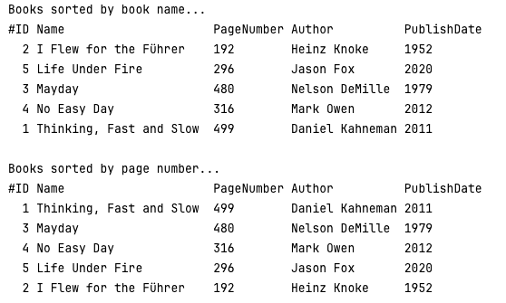

### Book Sorter
#### Description
Design a class named "Book". This class should inherit from the Comparable interface and override the "compareTo" method. Inside this method, write the code that sorts the book by name from A to Z. Create 5 objects from this class and store the objects in a data structure of Set type. Then, use a second data structure of Set type and ensure that the books are sorted by the number of pages.

The Book class consists of variables for the book name, number of pages, author's name, and publication date.

#### Screenshots


#### Requirements
- JDK Version is minimum [JDK8](https://www.oracle.com/tr/java/technologies/downloads/).

#### Usage
```
cd BookSorter/src
javac Main.java
```