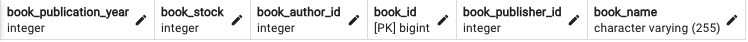
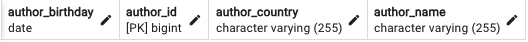
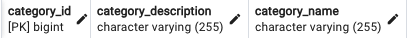
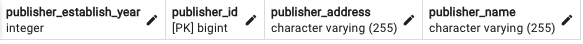

## Library Management System
#### Description
Design a library management system with entities like Book, Author, Category, Publisher, and Book 
Borrowing, establishing relationships among them. Use PostgreSQL database.


### Database Secreenshots
###### Book Table


###### Author Table


###### Category Table


###### Publisher Table


###### Book Borrowing Table


#### Requirements
- JDK Version is minimum [JDK22](https://www.oracle.com/tr/java/technologies/downloads/).

#### Usage
```
cd LibraryManagementSystem/src
javac Main.java
```