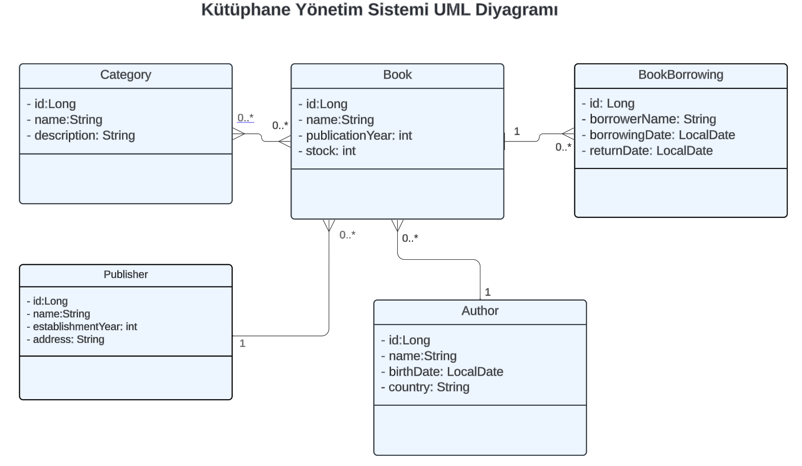

# Library Management System REST API

This project provides a REST API capable of performing CRUD (Create, Read, Update, Delete) operations for a library management system.

## Technologies Used

- Java
- Spring Boot
- Spring Data JPA
- PostgreSQL
- Lombok

## Installation

1. **Clone the Project**

    ```
    git clone https://github.com/semih-turan/LibraryManagementAPI.git
    ```

2. **Database Setup**

    - Create a PostgreSQL database.
    - Set your database connection details in `application.properties` file.

3. **Run the Application**

    Navigate to the project directory and run the following command:

    ```
    mvn spring-boot:run
    ```

4. **API Endpoints**

    | HTTP Method | Endpoint            | Description                                 |
    |-------------|---------------------|---------------------------------------------|
    | GET         | /books              | List all books                              |
    | GET         | /books/{id}         | Get a specific book                         |
    | POST        | /books              | Add a new book                              |
    | PUT         | /books/{id}         | Update a specific book                      |
    | DELETE      | /books/{id}         | Delete a specific book                      |
    | GET         | /categories         | List all categories                         |
    | GET         | /categories/{id}    | Get a specific category                     |
    | POST        | /categories         | Add a new category                          |
    | PUT         | /categories/{id}    | Update a specific category                  |
    | DELETE      | /categories/{id}    | Delete a specific category                  |
    | GET         | /publishers         | List all publishers                         |
    | GET         | /publishers/{id}    | Get a specific publisher                    |
    | POST        | /publishers         | Add a new publisher                         |
    | PUT         | /publishers/{id}    | Update a specific publisher                 |
    | DELETE      | /publishers/{id}    | Delete a specific publisher                 |

## Data Validation and DTOs

- Hibernate Validator is used for data validation.
- DTOs are used for request and response handling. For instance, to prevent the address from being returned in publisher GET requests or to avoid email input during book borrowing updates.

## Layered Architecture

The project is developed following a layered architecture. These layers include:

- Controller
- Service
- Repository
- Entity

## IoC and DI

Inversion of Control (IoC) and Dependency Injection (DI) principles are followed, utilizing constructor injection.

## UML Diagram



## License

This project is licensed under the MIT License. See the [LICENSE](LICENSE) file for more details.
