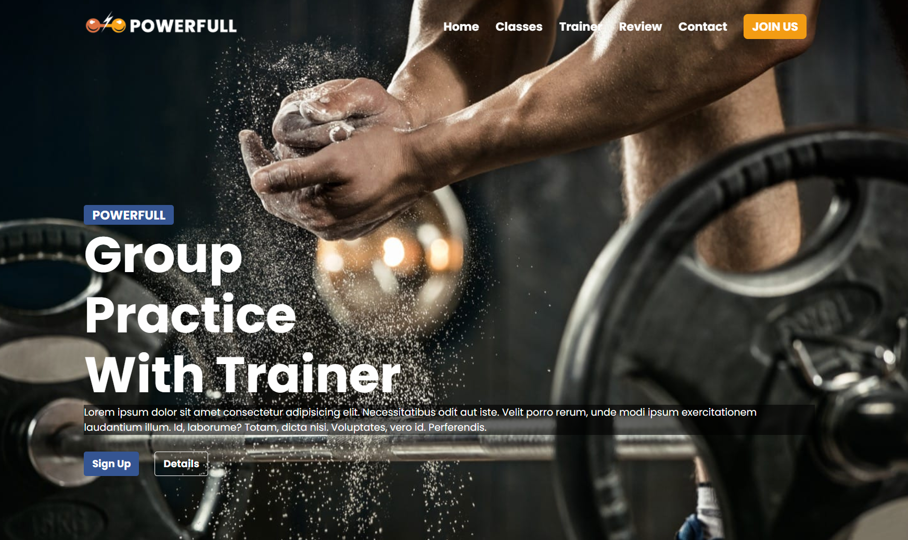

# Sports-Center
This project showcases a comprehensive Sports Center website that provides information about various sports activities, classes, trainers, and schedules. The site is designed to be fully responsive, ensuring a great user experience across different devices. Users can explore trainer profiles, view class schedules, and navigate the site with ease.

## Features

- Responsive Design: The website is optimized for all screen sizes, from mobile devices to desktops.

-Trainer Profiles: Users can view detailed profiles of trainers, including their expertise and available classes.

- Class Schedules: Up-to-date information on class schedules, including the types of sports offered.

- Interactive Elements: Hover effects and interactive cards enhance user engagement.

- Mobile Navigation: A hamburger menu for easy navigation on mobile devices.

### 🚀 Live Demo

<div align="center">
  
</div>

  <a href="https://sports-center-patika-dev.netlify.app/" target="_blank">
    
  </a>
</div>

## Technologies Used

- HTML
- CSS
- JavaScript

## Project Structure

```sh
├── index.html
├── css
│   └── style.css
├── js
│   └── script.js
└── assets
    └── images
        └── trainer1.jpg
        └── trainer2.jpg
        └── ...
```

## Getting Started

### Prerequisites

Make sure you have a modern web browser installed.

### Installation

1. Clone the repository:

```sh
git clone https://github.com/semih-turan/The-Full-Stack-Web-Development-Bootcamp/24-Week-Twenty-Fourth/Sports-Center/sports-center.git
```

2. Navigate to the project directory

```sh
cd sports-center
```

### Usage
1- Open index.html in your web browser.
2- Navigate through the website to explore trainer profiles, class schedules, and more.
3- For mobile users, use the hamburger menu to navigate through different sections of the website.

### Contributing
Contributions are welcome! Please feel free to submit a Pull Request.

### License

This project is licensed under the MIT License.