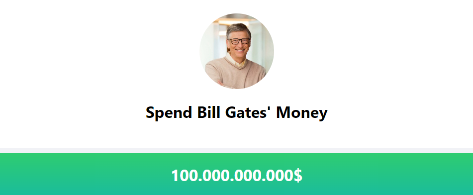

# Spend Bill Gates Money

## Diğer Dillerde Readme :books:

- :tr: [Türkçe](README_TR.md)
- :uk: [İngilizce](README.md)

## Teknoloji Yığını

    

# Bill Gates'ın Parasını Harca

## Tanıtım

Bill Gates'ın Parasını Harca'ya hoş geldiniz! Bu proje, kullanıcıların kendilerini Bill Gates gibi hayal edip, geniş servetini çeşitli ürünlere harcayabileceği "Bill Gates'ın Parasını Harca" web sitesinin bir klonudur.

## Proje Genel Bakış

1. Proje, hızlı ve belirli bir görüşe sahip bir web geliştirme derleme aracı olan Vite kullanılarak inşa edilmiştir. Vite, anlık sunucu başlatma ve sıcak modül değiştirme ile saniyeler içinde geliştirme deneyimi sunar.
 
2. Web sitesi, kullanıcıların farklı kategorilerden ürünleri seçip alışveriş sepetine ekleyebilecekleri kullanıcı dostu bir arayüz sunar. Seçilen ürünlerin toplam maliyeti dinamik olarak güncellenir ve kullanıcıya gösterilir.
 
3. Proje, seçilen ürünleri ve maliyetlerini takip etmek için React'in useState hook'u ile durum yönetiminden yararlanmaktadır. Bu, sorunsuz ve duyarlı bir kullanıcı deneyimi sağlar.
 
4. Kod, bakım ve okunabilirlik için en iyi uygulamaları takip eder. İyi yapılandırılmış ve düzenlenmiştir, bu da anlamayı ve değiştirmeyi kolaylaştırır.
 
5. Web sitesi, Vercel veya Netlify gibi bir platform kullanılarak dağıtılır, bu da projeye kolay erişim ve paylaşım sağlar.
 

"Bill Gates'ın Parasını Harca" web sitesinin bu klonunu oluşturarak, kullanıcılar eğlenirken hayal güçlerini keşfedebilir ve React geliştirme kavramlarını öğrenip pratik yapabilirler.

## Canlı Önizleme

https://spend-bill-gates-money-wine.vercel.app/

## Proje Ekran Görüntüleri

*Başlık Bölümü*

*Ürünler Bölümü*

*Fiş Bölümü*

## Lisans

Bu proje MIT Lisansı altında lisanslanmıştır. Daha fazla bilgi için LICENSE dosyasına başvurun.

## İletişim

  <a href="https://github.com/Bpolat0">
    

  <a href="https://discord.com/users/m.batuhanpolat">
    

  
  

